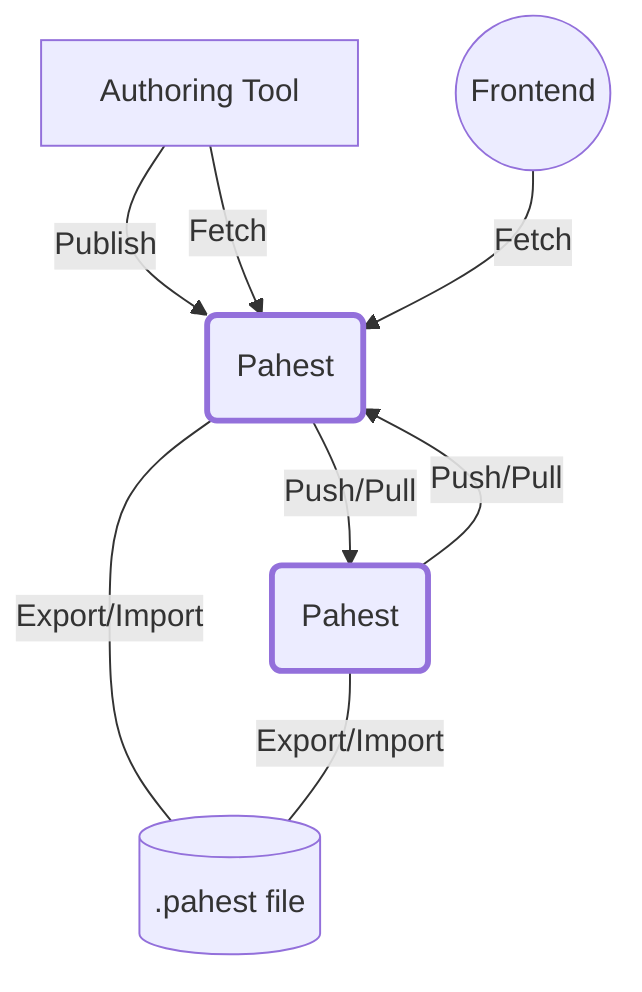

# Diagrams

## Fetch model

* Frontend fetches content from Pahest every time it's accessed
* The request is welcome to be cached

```mermaid
graph TD

    author[Authoring Tool] --Publish--> pahest(Pahest)
    author --Fetch--> pahest

    frontend((Frontend)) --Fetch--> pahest

    pahest --Push/Pull--> pahest2(Pahest)
    pahest2 --Push/Pull--> pahest

    pahest --Export/Import--- pod[(.pahest file)]
    pahest2 --Export/Import--- pod

    classDef imp stroke-width:3px;
    class pahest,pahest2 imp;
```

